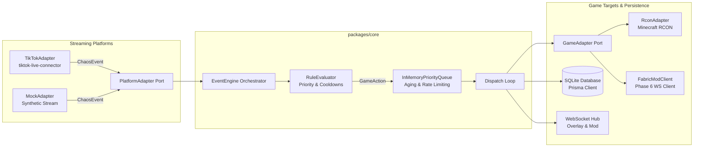

# Chaos-Live — Architecture Specification

## 1. System Overview

**Chaos-Live** is a modular, high-throughput, real-time event middleware designed to bridge live streaming audience engagement (starting with TikTok LIVE) to video games (starting with Minecraft Java Edition).

The system follows a strict **Hexagonal Architecture (Ports and Adapters)** pattern. Streaming platforms and game servers never interact directly; all communication passes through a decoupled domain kernel operating exclusively on a normalized event schema (`ChaosEvent`) and action protocol (`GameAction`).



---

## 2. Five-Stage Event Processing Pipeline

Every audience interaction flows through a deterministic, 5-stage lifecycle:

```
[1. Ingest & Normalize] ➜ [2. Validate] ➜ [3. Rule Evaluate] ➜ [4. Priority Queue] ➜ [5. Dispatch & Audit]
```

### Stage 1: Ingestion & Normalization (`PlatformAdapter`)
- Platform-specific events (e.g. TikTok Protobuf Webcast packets) are captured by the adapter.
- Normalizers translate raw payloads into typed `ChaosEvent<T>` envelopes containing:
  - `id`: Unique UUIDv4 used as a `correlationId` through all downstream stages.
  - `platform`: Literal platform identifier (`tiktok`, `mock`, `twitch`, `youtube`).
  - `type`: Discriminated event type (`gift`, `like`, `comment`, `follow`, `share`, `subscribe`).
  - `user`: Sanitized user identity (`id`, `displayName`).
  - `value`: Computed economic/engagement weight (e.g. diamonds × repeat streak for gifts, count for likes).
  - `metadata`: Strongly typed metadata per event type.
  - `raw`: Original payload preserved exclusively for debug logs.

### Stage 2: Validation
- The `EventEngine` verifies envelope integrity.
- Malformed packets immediately transition to `EVENT_FAILED` with correlation tracing.

### Stage 3: Rule Evaluation (`RuleEvaluator`)
- Rules are loaded from `config/rules.json` and sorted in descending priority order.
- The incoming `ChaosEvent` is evaluated against matcher conditions:
  - Event type whitelist (`eventTypes`)
  - Platform whitelist (`platforms`)
  - Value thresholds (`minValue`, `maxValue`)
  - Exact metadata attributes (`metadataMatch`, e.g. `{ giftName: "Rose" }`)
- Anti-spam cooldowns (`cooldownMs`) are evaluated per rule:
  - If on cooldown, emits `RULE_COOLDOWN` and halts.
  - If matched and eligible, dynamically interpolates variables (`${user.displayName}`, `${metadata.giftName}`) into command templates.
  - Produces a `GameAction`.

### Stage 4: Priority Queue & Anti-Starvation (`InMemoryPriorityQueue`)
- Actions are wrapped in `QueueItem` with admission priority.
- **Dynamic Aging (Anti-Starvation):** Low-priority actions gain priority score over time:
  $$\text{score}(t) = \text{basePriority} + \frac{t - t_{\text{enqueued}}}{1000} \times \text{agingFactor}$$
- **Sliding-Window Rate Limiting:** Enforces maximum actions per time window globally (`*`) and per action type (e.g. maximum 5 `spawn_mob` commands per 1000ms).
- When `dequeue()` is called, the queue yields the highest-scoring eligible action that does not violate active rate limits.

### Stage 5: Game Dispatch & Audit (`GameAdapter` & Prisma)
- The action is sent to the target `GameAdapter` (e.g., Minecraft RCON).
- Command strings are verified against a strict security whitelist and input sanitizers.
- State transitions are recorded in SQLite (`ProcessedEvent` table) via Prisma for audit trails, analytics, and session reporting.

---

## 3. Concurrency & Concurrency Isolation

1. **Non-Blocking Async Event Loop:** Single-threaded Node.js event loop ensures that synchronous CPU tasks (scoring, validation) are instantaneous (<1ms) while I/O operations (RCON network packets, SQLite writes) execute asynchronously.
2. **Circuit Breaker Pattern:** External connections (TikTok LIVE Webcast, Minecraft RCON) are shielded by a three-state circuit breaker:
   - `CLOSED`: Normal operation; failures are counted.
   - `OPEN`: Repeated failures trip the circuit; further attempts are halted to prevent connection spam or IP bans.
   - `HALF_OPEN`: Cooldown window expires; a single probe attempt tests server health before resetting or re-tripping.
3. **Queue Decoupling:** Stream burst traffic (such as gift-bombing raids with 100+ gifts/second) is buffered cleanly in memory. The game server receives commands at a controlled, safe cadence dictated by rate limit rules.

---

## 4. Observability & Tracing

Every event logs its complete state transition using structured JSON (Pino) tagged with its unique `correlationId`:

| State | Meaning |
|---|---|
| `EVENT_RECEIVED` | Stream platform emitted an event |
| `EVENT_VALIDATED` | Schema envelope confirmed |
| `RULE_MATCHED` | Matching rule found, `GameAction` generated |
| `RULE_NOT_MATCHED` | No configured rule covers this event |
| `RULE_COOLDOWN` | Rule matched but ignored due to active cooldown |
| `EVENT_QUEUED` | Action admitted to priority queue |
| `ACTION_DISPATCHED` | Action dequeued and transmitted to game adapter |
| `EVENT_COMPLETED` | Game server confirmed command execution |
| `EVENT_FAILED` | Error occurred during processing or game execution |
